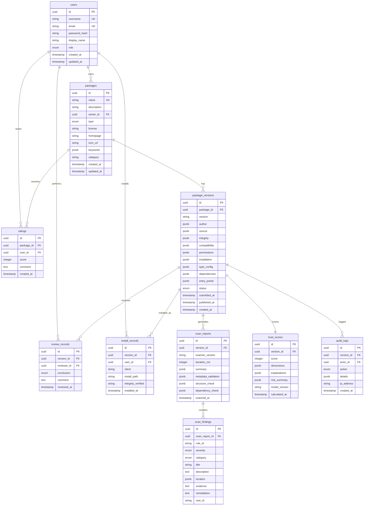

# 数据库 ER 图与数据模型设计

> 版本：v0.1  
> 冻结时间：第 2 周中  
> 数据库：PostgreSQL  
> 关联文档：`packages/schema/agent-package.schema.json`、`docs/metadata-spec.md`

## 1. ER 图（实体关系图）



## 2. 表结构详细定义

### 2.1 users — 用户表

| 列名 | 类型 | 约束 | 说明 |
|------|------|------|------|
| `id` | `UUID` | PK, DEFAULT gen_random_uuid() | 用户唯一 ID |
| `username` | `VARCHAR(64)` | UNIQUE, NOT NULL | 用户名 |
| `email` | `VARCHAR(254)` | UNIQUE, NOT NULL | 邮箱 |
| `password_hash` | `VARCHAR(255)` | NOT NULL | 密码哈希（bcrypt） |
| `display_name` | `VARCHAR(100)` | | 显示名称 |
| `role` | `ENUM('user','submitter','reviewer','admin')` | NOT NULL, DEFAULT 'user' | 角色 |
| `created_at` | `TIMESTAMPTZ` | NOT NULL, DEFAULT NOW() | |
| `updated_at` | `TIMESTAMPTZ` | NOT NULL, DEFAULT NOW() | |

索引：`idx_users_role ON users(role)`

### 2.2 packages — 能力包表

| 列名 | 类型 | 约束 | 说明 |
|------|------|------|------|
| `id` | `UUID` | PK | |
| `name` | `VARCHAR(64)` | UNIQUE, NOT NULL | kebab-case |
| `description` | `VARCHAR(200)` | NOT NULL | |
| `owner_id` | `UUID` | FK → users.id, NOT NULL | 所有者 |
| `type` | `ENUM('skill','mcp_server','plugin','subagent','command','prompt')` | NOT NULL | |
| `license` | `VARCHAR(64)` | | SPDX 标识符 |
| `homepage` | `VARCHAR(512)` | | |
| `icon_url` | `VARCHAR(512)` | | |
| `keywords` | `JSONB` | DEFAULT '[]' | 字符串数组 |
| `category` | `VARCHAR(50)` | | |
| `created_at` | `TIMESTAMPTZ` | NOT NULL, DEFAULT NOW() | |
| `updated_at` | `TIMESTAMPTZ` | NOT NULL, DEFAULT NOW() | |

索引：
- `idx_packages_type ON packages(type)`
- `idx_packages_owner ON packages(owner_id)`
- `idx_packages_name ON packages(name)`
- `idx_packages_keywords ON packages USING GIN (keywords)`
- `idx_packages_category ON packages(category)`

### 2.3 package_versions — 版本表（核心表）

| 列名 | 类型 | 约束 | 说明 |
|------|------|------|------|
| `id` | `UUID` | PK | |
| `package_id` | `UUID` | FK → packages.id, NOT NULL | |
| `version` | `VARCHAR(64)` | NOT NULL | SemVer |
| `author` | `JSONB` | NOT NULL | `{name, email, url}` |
| `source` | `JSONB` | NOT NULL | `{type, repository_url, owner, repo, ref_type, ref, commit_hash, ...}` |
| `integrity` | `JSONB` | NOT NULL | `{sha256, signature, attestation_url, sbom_url}` |
| `compatibility` | `JSONB` | NOT NULL | 客户端枚举数组 |
| `permissions` | `JSONB` | NOT NULL | 完整权限声明 |
| `installation` | `JSONB` | NOT NULL | 安装方式 |
| `type_config` | `JSONB` | | 类型专属配置（skill_config, mcp_server_config 等） |
| `dependencies` | `JSONB` | | 依赖声明 |
| `entry_points` | `JSONB` | | 入口文件 |
| `status` | `ENUM('draft','submitted','scanning','error','pending_review','approved','rejected','published','yanked','resubmitted')` | NOT NULL, DEFAULT 'draft' | |
| `submitted_at` | `TIMESTAMPTZ` | | |
| `published_at` | `TIMESTAMPTZ` | | |
| `created_at` | `TIMESTAMPTZ` | NOT NULL, DEFAULT NOW() | |

索引：
- `idx_versions_package ON package_versions(package_id)`
- `idx_versions_status ON package_versions(status)`
- `idx_versions_package_version ON package_versions(package_id, version) UNIQUE`

### 2.4 scan_reports — 扫描报告表

| 列名 | 类型 | 约束 | 说明 |
|------|------|------|------|
| `id` | `UUID` | PK | |
| `version_id` | `UUID` | FK → package_versions.id, NOT NULL | |
| `scanner_version` | `VARCHAR(32)` | NOT NULL | |
| `duration_ms` | `INTEGER` | | |
| `summary` | `JSONB` | NOT NULL | `{total, critical, high, medium, low, info, pass_rate}` |
| `metadata_validation` | `JSONB` | | `{valid, errors[]}` |
| `structure_check` | `JSONB` | | `{valid, missing_files[], extra_files[]}` |
| `dependency_check` | `JSONB` | | `{total_dependencies, known_vulnerabilities, unlocked_versions, suspicious_packages[]}` |
| `scanned_at` | `TIMESTAMPTZ` | NOT NULL, DEFAULT NOW() | |

索引：`idx_scan_reports_version ON scan_reports(version_id)`

### 2.5 scan_findings — 扫描发现表

| 列名 | 类型 | 约束 | 说明 |
|------|------|------|------|
| `id` | `UUID` | PK | |
| `scan_report_id` | `UUID` | FK → scan_reports.id, NOT NULL | |
| `rule_id` | `VARCHAR(20)` | NOT NULL | 如 `SR-001` |
| `severity` | `ENUM('critical','high','medium','low','info')` | NOT NULL | |
| `category` | `ENUM('prompt_injection','dangerous_shell','credential_access','hardcoded_secret','remote_code_execution','excessive_permission','network_access','dependency_risk','source_integrity','metadata_quality')` | NOT NULL | |
| `title` | `VARCHAR(200)` | NOT NULL | |
| `description` | `TEXT` | | |
| `location` | `JSONB` | NOT NULL | `{file, line, column, end_line, end_column, snippet}` |
| `evidence` | `TEXT` | | |
| `remediation` | `TEXT` | | |
| `cwe_id` | `VARCHAR(20)` | | |

索引：
- `idx_findings_report ON scan_findings(scan_report_id)`
- `idx_findings_severity ON scan_findings(severity)`

### 2.6 review_records — 审核记录表

| 列名 | 类型 | 约束 | 说明 |
|------|------|------|------|
| `id` | `UUID` | PK | |
| `version_id` | `UUID` | FK → package_versions.id, NOT NULL | |
| `reviewer_id` | `UUID` | FK → users.id, NOT NULL | |
| `conclusion` | `ENUM('approved','rejected','changes_requested')` | NOT NULL | |
| `comment` | `TEXT` | | 审核意见 |
| `reviewed_at` | `TIMESTAMPTZ` | NOT NULL, DEFAULT NOW() | |

索引：`idx_reviews_version ON review_records(version_id)`

### 2.7 trust_scores — 信任评分表

| 列名 | 类型 | 约束 | 说明 |
|------|------|------|------|
| `id` | `UUID` | PK | |
| `version_id` | `UUID` | FK → package_versions.id, UNIQUE, NOT NULL | 每版本一条 |
| `score` | `INTEGER` | NOT NULL, CHECK(0 <= score <= 100) | |
| `dimensions` | `JSONB` | NOT NULL | 9 个维度得分和权重 |
| `explanations` | `JSONB` | NOT NULL | 扣分解释数组 |
| `risk_summary` | `JSONB` | | `{level, top_risks[], install_recommendation}` |
| `model_version` | `VARCHAR(32)` | NOT NULL | |
| `calculated_at` | `TIMESTAMPTZ` | NOT NULL, DEFAULT NOW() | |

索引：`idx_scores_score ON trust_scores(score)`

### 2.8 ratings — 评分/评论表

| 列名 | 类型 | 约束 | 说明 |
|------|------|------|------|
| `id` | `UUID` | PK | |
| `package_id` | `UUID` | FK → packages.id, NOT NULL | |
| `user_id` | `UUID` | FK → users.id, NOT NULL | |
| `score` | `INTEGER` | NOT NULL, CHECK(1 <= score <= 5) | |
| `comment` | `TEXT` | | |
| `created_at` | `TIMESTAMPTZ` | NOT NULL, DEFAULT NOW() | |

索引：`idx_ratings_package ON ratings(package_id)`
约束：`UNIQUE(package_id, user_id)` 每人每包只能评一次

### 2.9 install_records — 安装记录表

| 列名 | 类型 | 约束 | 说明 |
|------|------|------|------|
| `id` | `UUID` | PK | |
| `version_id` | `UUID` | FK → package_versions.id, NOT NULL | |
| `user_id` | `UUID` | FK → users.id | 可为空（匿名安装） |
| `client` | `VARCHAR(50)` | NOT NULL | 客户端标识 |
| `install_path` | `VARCHAR(512)` | NOT NULL | |
| `integrity_verified` | `BOOLEAN` | NOT NULL, DEFAULT false | sha256 校验是否通过 |
| `installed_at` | `TIMESTAMPTZ` | NOT NULL, DEFAULT NOW() | |

索引：`idx_installs_version ON install_records(version_id)`

### 2.10 audit_logs — 审计日志表

| 列名 | 类型 | 约束 | 说明 |
|------|------|------|------|
| `id` | `UUID` | PK | |
| `version_id` | `UUID` | FK → package_versions.id | |
| `actor_id` | `UUID` | FK → users.id | |
| `action` | `ENUM('submit','scan_start','scan_complete','approve','reject','request_changes','publish','yank','unyank','resubmit')` | NOT NULL | |
| `details` | `JSONB` | | 操作详情 |
| `ip_address` | `INET` | | |
| `created_at` | `TIMESTAMPTZ` | NOT NULL, DEFAULT NOW() | |

索引：
- `idx_audit_version ON audit_logs(version_id)`
- `idx_audit_action ON audit_logs(action)`
- `idx_audit_created ON audit_logs(created_at)`

## 3. PostgreSQL ENUM 定义

```sql
-- 用户角色
CREATE TYPE user_role AS ENUM ('user', 'submitter', 'reviewer', 'admin');

-- 能力包类型
CREATE TYPE package_type AS ENUM ('skill', 'mcp_server', 'plugin', 'subagent', 'command', 'prompt');

-- 版本状态
CREATE TYPE version_status AS ENUM (
  'draft', 'submitted', 'scanning', 'error',
  'pending_review', 'approved', 'rejected',
  'published', 'yanked', 'resubmitted'
);

-- 发现严重程度
CREATE TYPE finding_severity AS ENUM ('critical', 'high', 'medium', 'low', 'info');

-- 发现分类
CREATE TYPE finding_category AS ENUM (
  'prompt_injection', 'dangerous_shell', 'credential_access',
  'hardcoded_secret', 'remote_code_execution', 'excessive_permission',
  'network_access', 'dependency_risk', 'source_integrity', 'metadata_quality'
);

-- 审核结论
CREATE TYPE review_conclusion AS ENUM ('approved', 'rejected', 'changes_requested');

-- 审计操作类型
CREATE TYPE audit_action AS ENUM (
  'submit', 'scan_start', 'scan_complete',
  'approve', 'reject', 'request_changes',
  'publish', 'yank', 'unyank', 'resubmit'
);
```

## 4. 关键查询模式

### 4.1 首页能力包列表（带评分）

```sql
SELECT
  p.id, p.name, p.description, p.type, p.license,
  pv.version, pv.status,
  ts.score AS trust_score,
  ts.risk_summary->>'level' AS risk_level,
  COUNT(DISTINCT ir.id) AS install_count,
  AVG(r.score) AS avg_rating
FROM packages p
JOIN package_versions pv ON pv.package_id = p.id
LEFT JOIN trust_scores ts ON ts.version_id = pv.id
LEFT JOIN install_records ir ON ir.version_id = pv.id
LEFT JOIN ratings r ON r.package_id = p.id
WHERE pv.status = 'published'
GROUP BY p.id, pv.id, ts.score, ts.risk_summary
ORDER BY ts.score DESC, install_count DESC
LIMIT 20 OFFSET 0;
```

### 4.2 能力包详情（含完整评分解释）

```sql
SELECT
  p.*, pv.*,
  ts.score, ts.dimensions, ts.explanations, ts.risk_summary,
  sr.summary AS scan_summary,
  json_agg(DISTINCT sf.*) AS findings,
  json_agg(DISTINCT rr.*) AS review_history
FROM packages p
JOIN package_versions pv ON pv.package_id = p.id
LEFT JOIN trust_scores ts ON ts.version_id = pv.id
LEFT JOIN scan_reports sr ON sr.version_id = pv.id
LEFT JOIN scan_findings sf ON sf.scan_report_id = sr.id
LEFT JOIN review_records rr ON rr.version_id = pv.id
WHERE p.name = $1 AND pv.version = $2
GROUP BY p.id, pv.id, ts.id, sr.id;
```

### 4.3 审核队列

```sql
SELECT
  p.name, p.type, pv.version, pv.status,
  pv.submitted_at, ts.score,
  sr.summary->>'critical' AS critical_count,
  sr.summary->>'high' AS high_count
FROM package_versions pv
JOIN packages p ON p.id = pv.package_id
LEFT JOIN trust_scores ts ON ts.version_id = pv.id
LEFT JOIN scan_reports sr ON sr.version_id = pv.id
WHERE pv.status IN ('pending_review')
ORDER BY pv.submitted_at ASC;
```

## 5. 数据迁移建议

- 使用 Alembic（Python）或 Prisma（TypeScript）管理迁移
- 每个 ENUM 变更需要创建新迁移
- JSONB 字段适用于 Schema 可能演进的字段，降低迁移频率
- `audit_logs` 表建议按月分区
- `install_records` 表建议按季度分区
